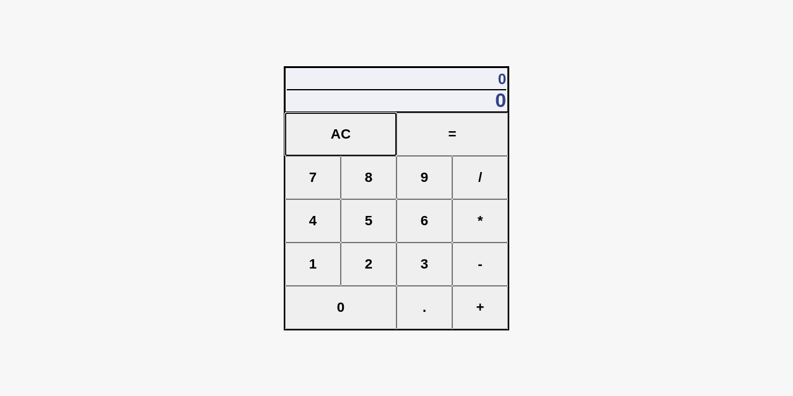

# Basic Calculator
This web application allows the user to create and evaluate expressions. This calculator uses expression logic rather than immediate execution logic, which may change the resulting value of evaluating inputted operators and operands. The user can select a combination of numbers and a decimal point to represent operands. Available operators are addition, subtraction, multiplication, and division. The user can press the "AC" button to clear the expression and any evaluated result. 

## References
This application was built using React.

## Webpage
[GitHub Page](https://evanahdout.github.io/basic-calculator/)

## Preview

